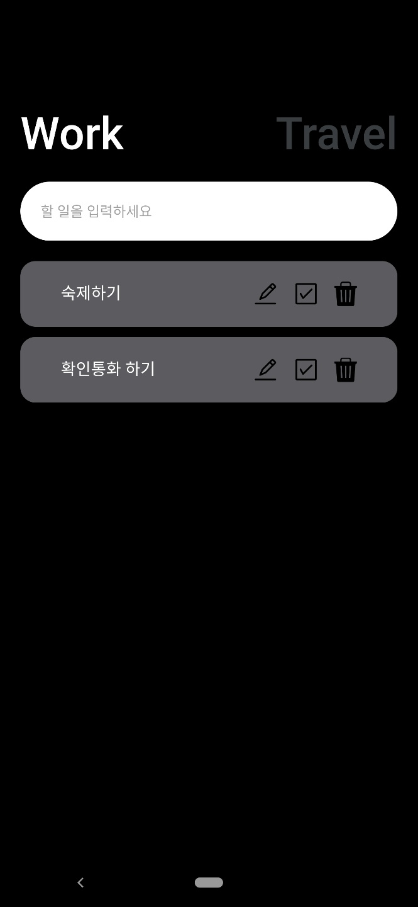

# ReactNative TodoApp 만들기 
Work Hard Travel Hard APP 클론   


## 주요 학습내용
- AsyncStorage활용하여 입력값을 storage에 저장,삭제하기   
  이를 활용하여 사용자가 보고 있던 마지막페이지가 어디인지 기억해놓거나, 사용자 입력값들을 유지시킬 수 있었다.
- theme object에 메인색상 정의해두고 import하여 사용하기
- Object.assign()
- 버튼이벤트 
- TextInput에서 키보드 제어방법

## toDos데이터 구조 

```js
{
    Date.now() : {text,working,completed},
    Date.now() : {text,working,completed},
    Date.now() : {text,working,completed},
}
```

## React Native Packages
https://reactnative.dev/
- TouchableOpacity
- TextInput
- Alert
- TouchableOpacity

## Third Party Packages 
https://docs.expo.dev/versions/latest/
- @react-native-async-storage/async-storage


